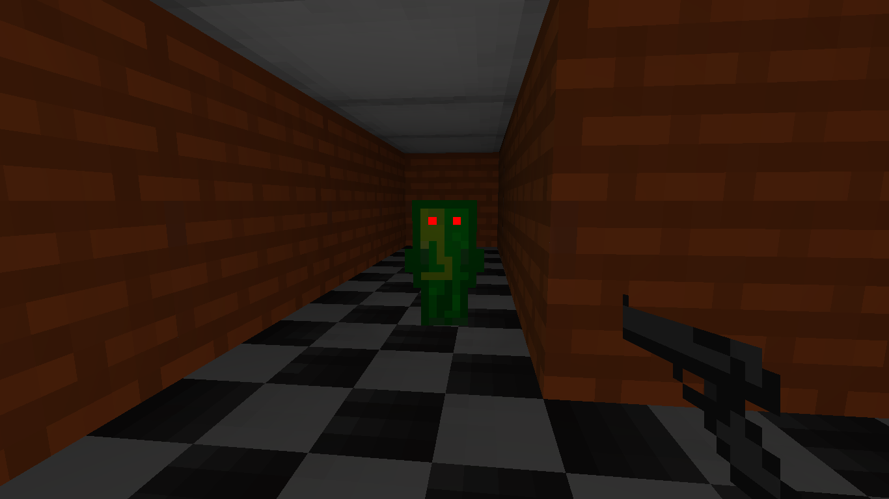
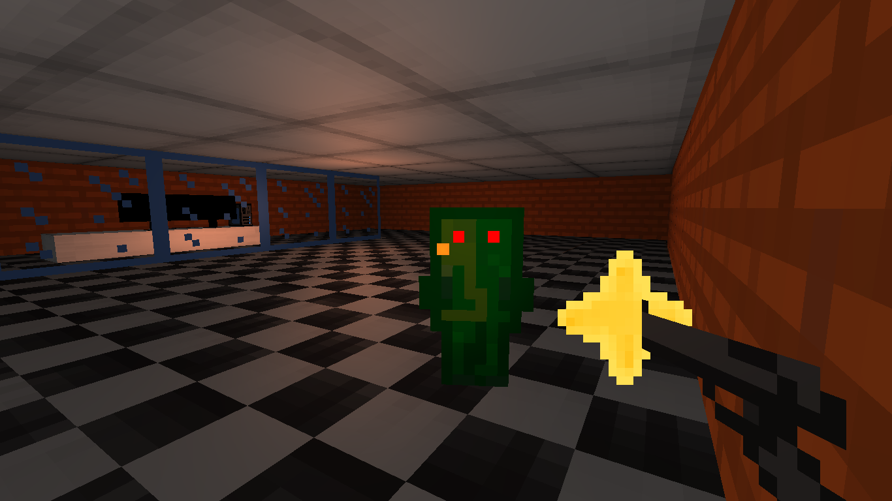
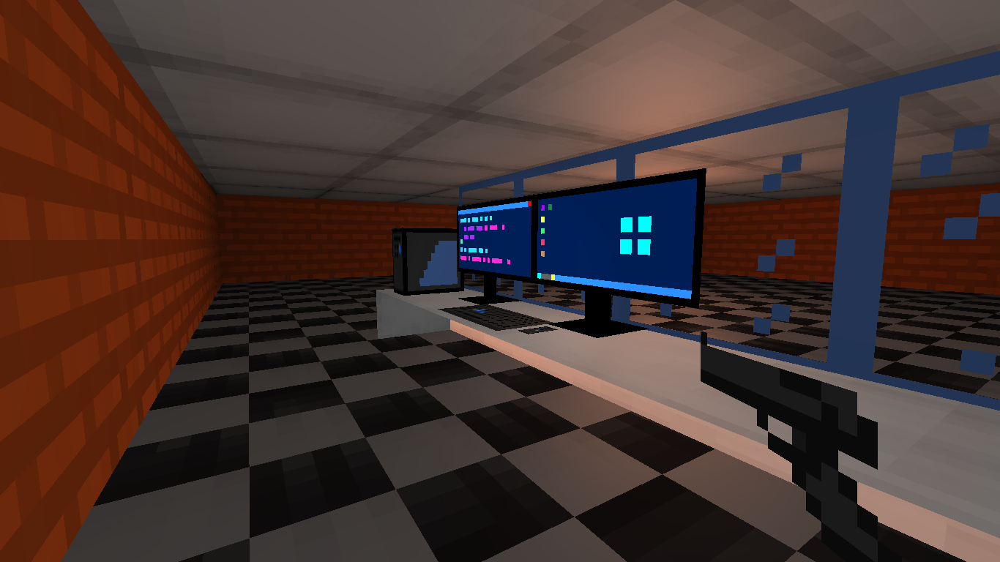

# CoolGameEngine

- OpenGL 3.0+ for rendering.
- AABB collision detection with uniform grid spatial algorithm.
- A* path finding algorithm.
- WASD and mouse for player movement, left click to fire.
- Used Eclipse 

- youtube link : https://www.youtube.com/watch?v=fxU6KntFP5Q&feature=youtu.be